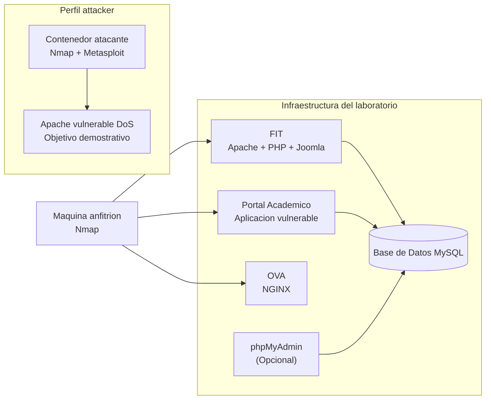

# 🔐 Laboratorio de Seguridad Ofensiva con Docker


---

## 🧭 Descripción

Este laboratorio permite simular un entorno controlado de pruebas de seguridad ofensiva, orientado al reconocimiento de servicios y a la ejecución de pruebas de explotación controladas sobre contenedores preparados con fines educativos.

El escenario está construido completamente con Docker, lo que facilita su despliegue, reproducción y reutilización en sesiones de laboratorio.

---

## 🏗️ Arquitectura del laboratorio



---

## 📦 Componentes del laboratorio

| Componente | Descripción | Tipo |
|----------|------------|------|
| 🖥️ Máquina anfitrión | Equipo desde el cual se ejecuta Nmap en la primera fase | Obligatorio |
| 🌐 FIT (Joomla) | Aplicación web sobre Apache + PHP | Obligatorio |
| 🎓 Portal Académico | Aplicación vulnerable para pruebas de análisis | Obligatorio |
| 🌍 OVA (NGINX) | Servicio web adicional para identificación y validación de falso positivo | Obligatorio |
| 🗄️ MySQL | Base de datos del entorno | Obligatorio |
| 🧰 phpMyAdmin | Administración de base de datos | Opcional |
| 🛠️ Contenedor atacante | Herramientas de reconocimiento y explotación con Metasploit | Perfil attacker |
| 💥 Apache vulnerable DoS | Objetivo específico para la demostración de denegación de servicio | Perfil attacker |

---

## ⚙️ Requisitos

- Docker
- Docker Compose
- Git
- Nmap instalado en la máquina anfitrión para la primera fase

---

## 🚀 Preparación del laboratorio

### 1. Clonar el repositorio

```bash
git clone https://github.com/danfelun/lab-fit-cp.git
cd lab-fit-cp
```

### 2. Configurar variables de entorno

Antes de ejecutar el laboratorio, configure el archivo de variables de entorno:

```bash
cp .env.example .env
nano .env
```

Ajuste allí las credenciales, nombres de bases de datos y demás parámetros del entorno.

⚠️ Este paso es obligatorio.

---

## ▶️ Momento 1: Identificación de servicios desde la máquina anfitrión

En este primer momento se despliega únicamente el escenario base del laboratorio. El objetivo es que los estudiantes ejecuten procesos de descubrimiento de puertos, identificación de servicios y análisis inicial de superficie de ataque directamente desde la máquina anfitrión.

### Levantar escenario base

```bash
docker compose up -d --build
```

### Levantar servicios opcionales si se desean para administración

```bash
docker compose --profile optional up -d --build
```

### Actividades sugeridas en esta fase

- Descubrimiento de puertos abiertos
- Identificación de servicios expuestos
- Detección de tecnologías visibles
- Análisis de diferencias entre Apache y NGINX
- Validación del caso de falso positivo sobre OVA

### Ejemplos de uso de Nmap desde la máquina anfitrión

```bash
nmap -sV localhost
```

```bash
nmap -sV -p- localhost
```

```bash
nmap --script vuln localhost
```

### Enfoque didáctico del falso positivo

En esta fase se puede analizar cómo Nmap reporta una supuesta vulnerabilidad de denegación de servicio en el servicio expuesto por OVA, aunque dicho servicio corresponde a NGINX y no a Apache vulnerable. Esto permite discutir con los estudiantes la diferencia entre:

- detección automatizada
- validación técnica
- falso positivo
- explotación real

---

## ▶️ Momento 2: Demostración de explotación con el perfil attacker

En este segundo momento se levantan los contenedores asociados al perfil `attacker`, especialmente:

- la máquina atacante
- el objetivo vulnerable a denegación de servicio

La finalidad es ingresar al contenedor atacante, configurar el módulo auxiliar correspondiente en Metasploit y ejecutar el ataque sobre el servicio Apache vulnerable preparado para la demostración.

### Levantar perfil attacker

```bash
docker compose --profile attacker up -d --build
```

### Acceder al contenedor atacante

```bash
docker exec -it lab-atacante sh
```

### Verificar herramientas disponibles

```bash
nmap --version
```

```bash
msfconsole
```

### Ejemplo de reconocimiento interno

```bash
nmap -sV <objetivo>
```

### Flujo sugerido de demostración en vivo

1. Verificar que el servicio vulnerable responde normalmente.
2. Ingresar al contenedor atacante.
3. Abrir Metasploit.
4. Configurar el módulo auxiliar de DoS para Apache.
5. Lanzar la prueba contra el objetivo preparado.
6. Observar cómo el servicio se degrada o deja de responder al cabo de un tiempo.

### Idea general del ejercicio

- En el primer momento se muestra que una detección no equivale automáticamente a una explotación válida.
- En el segundo momento se demuestra una explotación preparada sobre un objetivo realmente vulnerable.

---

## 🎯 Enfoque pedagógico

Este laboratorio está diseñado para que el estudiante:

- Descubra servicios y puertos por sí mismo
- Analice diferencias entre tecnologías
- Distinga entre falso positivo y vulnerabilidad real
- Relacione vulnerabilidades con servicios específicos
- Comprenda el impacto real de una explotación controlada

---

## ⚠️ Consideraciones de seguridad

Este laboratorio contiene vulnerabilidades intencionales.

- No debe exponerse a internet
- Debe ejecutarse únicamente en entornos controlados
- Su uso es exclusivamente educativo

---

## 🧩 Tecnologías utilizadas

- Docker & Docker Compose
- Apache + PHP
- NGINX
- MySQL
- phpMyAdmin
- Nmap
- Metasploit Framework
