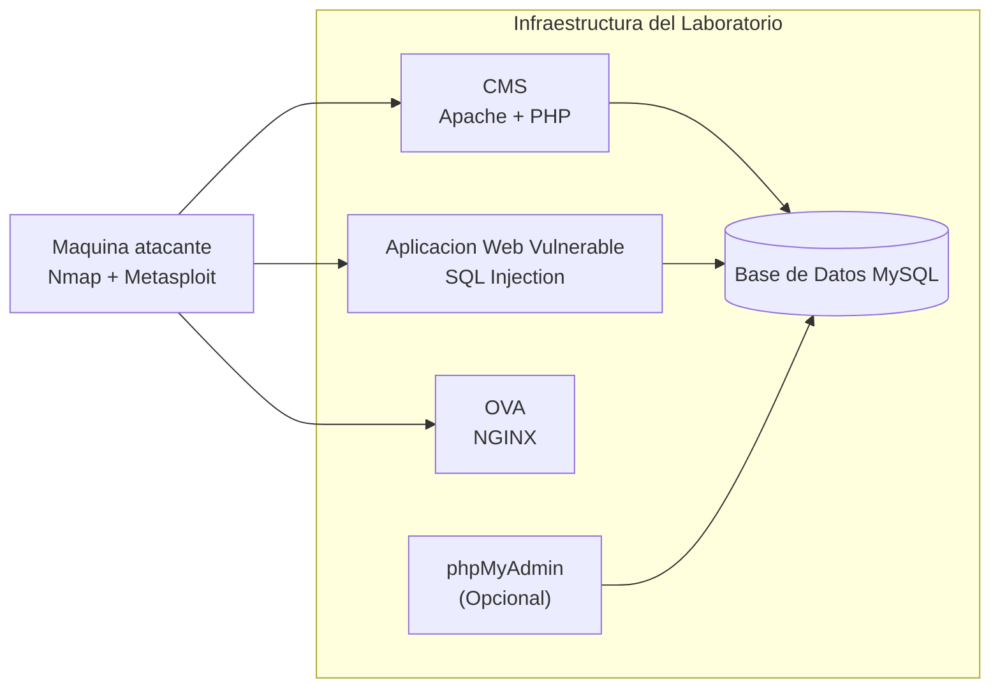

# 🔐 Laboratorio de Seguridad Ofensiva con Docker


---

## 🧭 Descripción

Este laboratorio permite simular un entorno controlado de pruebas de seguridad ofensiva, donde los estudiantes podrán:

- Identificar servicios expuestos
- Analizar superficie de ataque
- Detectar vulnerabilidades en aplicaciones web
- Ejecutar pruebas de explotación controladas

El entorno está completamente basado en contenedores Docker, lo que permite su despliegue rápido, reproducible y portable.

---

## 🏗️ Arquitectura del laboratorio



---

## 📦 Componentes del laboratorio

| Componente | Descripción | Tipo |
|----------|------------|------|
| 🖥️ Contenedor atacante | Herramientas de reconocimiento y explotación | Obligatorio |
| 🌐 CMS (Joomla) | Aplicación web sobre Apache | Obligatorio |
| 🎓 Portal vulnerable | Aplicación con vulnerabilidades de entrada | Obligatorio |
| 🌍 OVA (NGINX) | Servicio web adicional para análisis | Obligatorio |
| 🗄️ MySQL | Base de datos del entorno | Obligatorio |
| 🧰 phpMyAdmin | Administración de base de datos | Opcional |

---

## ⚙️ Requisitos

- Docker
- Docker Compose
- Git

---

## 🚀 Despliegue del laboratorio

### 1. Clonar el repositorio

```bash
git clone https://github.com/danfelun/lab-fit-cp.git
cd lab-fit-cp
```

### 2. Configuración de variables de entorno

Antes de ejecutar el laboratorio, configure el archivo de variables de entorno:

```bash
cp .env.example .env
nano .env
```

Ajuste allí las credenciales, nombres de bases de datos y demás parámetros del entorno.

⚠️ Este paso es obligatorio.

### 3. Construcción y despliegue

Escenario base:

```bash
docker compose up -d --build
```

Contenedor atacante:

```bash
docker compose --profile attacker up -d --build
```

Servicios opcionales:

```bash
docker compose --profile optional up -d --build
```

---

## 🧪 Uso del laboratorio

Acceso al contenedor atacante:

```bash
docker exec -it lab-atacante sh
```

Ejemplo de reconocimiento:

```bash
nmap -sV <objetivo>
```

Ejecutar Metasploit:

```bash
msfconsole
```

---

## 🎯 Enfoque pedagógico

Este laboratorio está diseñado para que el estudiante:

- Descubra servicios y puertos por sí mismo
- Analice diferencias entre tecnologías
- Identifique malas prácticas de configuración
- Relacione vulnerabilidades con servicios expuestos
- Comprenda el impacto real de una explotación

---

## ⚠️ Consideraciones de seguridad

Este laboratorio contiene vulnerabilidades intencionales.

- No debe exponerse a internet
- Debe ejecutarse únicamente en entornos controlados
- Su uso es exclusivamente educativo

---

## 🧩 Tecnologías utilizadas

- Docker & Docker Compose
- Apache + PHP
- NGINX
- MySQL
- phpMyAdmin
- Nmap
- Metasploit Framework
