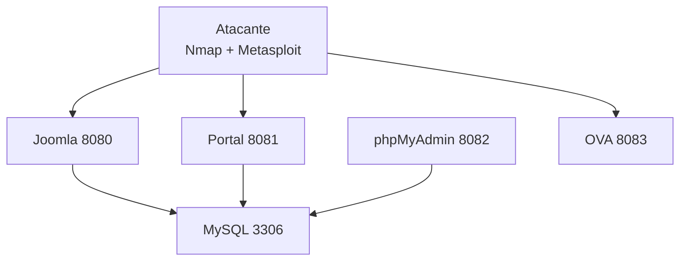

# 🔐 Laboratorio de Seguridad Ofensiva con Docker


## 🏗️ Arquitectura



## 🚀 Despliegue

```bash
docker compose up -d --build
docker compose --profile attacker up -d --build
docker compose --profile optional up -d --build
```

## ⚠️ Uso educativo
Solo para entornos controlados.
